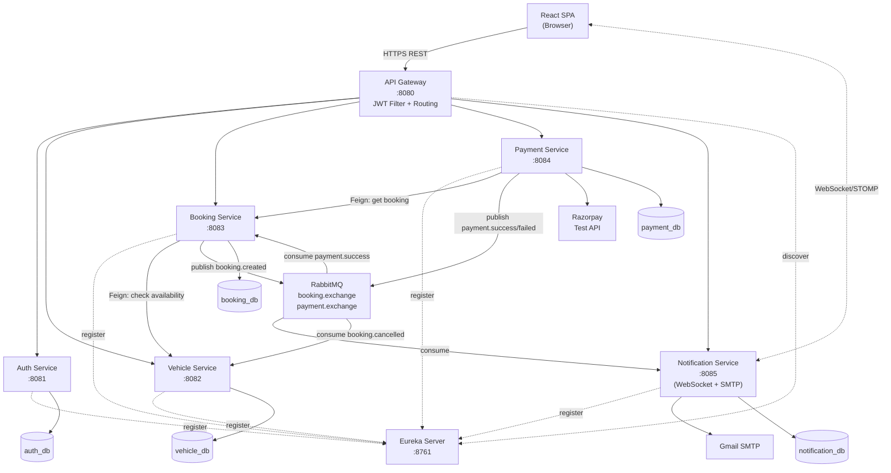
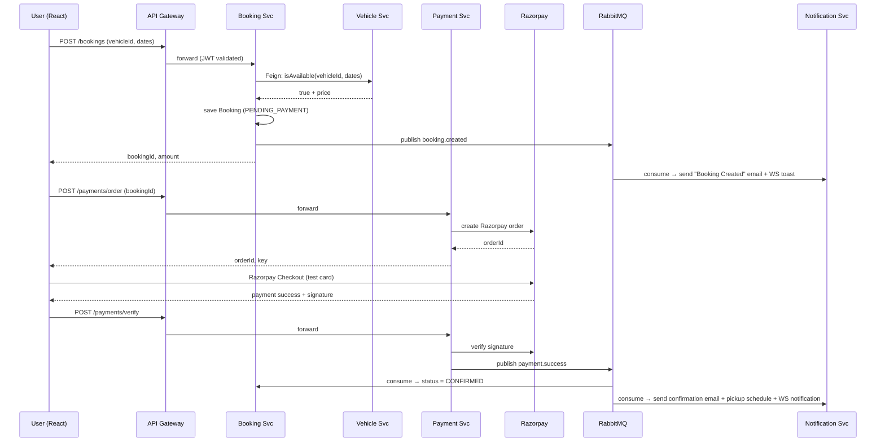

# Vehicle Rental System — Comprehensive Plan

## 1. Final Tech Stack (100% Free)

**Frontend**
- React 18 + Vite, TailwindCSS, React Router v6
- Redux Toolkit + RTK Query (state + API caching)
- Axios (with JWT interceptor), `@stomp/stompjs` + `sockjs-client` (real-time notifications)
- Razorpay Checkout JS (test mode), `react-hot-toast`, `react-datepicker`

**Backend (Spring Boot 3.x, Java 17, Maven)**
- Spring Cloud: Eureka, Gateway, OpenFeign, Resilience4j (circuit breaker)
- Spring Security + JJWT (JWT auth, RBAC)
- Spring Data JPA (MySQL 8), Flyway (DB migrations)
- Spring AMQP (RabbitMQ), Spring WebSocket + STOMP, Spring Mail (Gmail SMTP)
- Springdoc OpenAPI (Swagger UI per service)
- Lombok, MapStruct

**Infrastructure (all via Docker Compose)**
- MySQL 8, RabbitMQ 3 (with management UI), Zipkin (optional tracing)

## 2. Architecture (Updated from Your Diagram)

I've kept your core idea and added: **API Gateway** (single entry + JWT validation), **Auth Service** (separated from Booking for clean RBAC), **Notification Service** (consumes events), **RabbitMQ** for decoupling.



## 3. Microservices Responsibilities

- **Eureka Server** (`:8761`) — Service registry.
- **API Gateway** (`:8080`) — Single entry point, route prefixes (`/auth/**`, `/vehicles/**`, `/bookings/**`, `/payments/**`, `/notifications/**`), global JWT validation filter, CORS, rate-limiting (Resilience4j).
- **Auth Service** (`:8081`) — Register, login, JWT issuance/refresh, RBAC (`ROLE_USER`, `ROLE_ADMIN`), user profile. Owns `auth_db` (users, roles, user_roles).
- **Vehicle Service** (`:8082`) — Vehicle CRUD (admin), search/filter by type/location/price/date, availability check API, image upload (stored in `/uploads` volume). Listens for `booking.cancelled` to free up vehicle. Owns `vehicle_db`.
- **Booking Service** (`:8083`) — Create/cancel/list bookings, pickup-dropoff scheduling, date overlap validation. Calls Vehicle via Feign. Publishes `booking.created`, `booking.cancelled`. Consumes `payment.success` to confirm. Owns `booking_db`.
- **Payment Service** (`:8084`) — Razorpay order create, signature verify, refund (test). Publishes `payment.success` / `payment.failed`. Owns `payment_db` (payments, transactions).
- **Notification Service** (`:8085`) — Consumes all events, sends email via Gmail SMTP (booking confirmation, payment receipt, pickup reminder), pushes real-time WebSocket notifications to logged-in user, persists notification history. Owns `notification_db`.

## 4. Key Data Flows

**Booking + Payment + Notification flow:**



## 5. Database Schemas (high-level)

- **auth_db**: `users(id, email, password_hash, full_name, phone, created_at)`, `roles(id, name)`, `user_roles(user_id, role_id)`
- **vehicle_db**: `vehicles(id, name, brand, type, transmission, fuel, seats, price_per_day, location, status, image_url)`, `vehicle_categories`
- **booking_db**: `bookings(id, user_id, vehicle_id, pickup_at, dropoff_at, pickup_location, dropoff_location, total_amount, status)` — status enum: `PENDING_PAYMENT, CONFIRMED, CANCELLED, COMPLETED`
- **payment_db**: `payments(id, booking_id, user_id, razorpay_order_id, razorpay_payment_id, amount, status, created_at)`
- **notification_db**: `notifications(id, user_id, type, title, message, channel, read_flag, created_at)`

## 6. Project Structure

```
vehicle-rental-system/
├── backend/
│   ├── pom.xml                          (parent, dependency mgmt)
│   ├── common-lib/                      (shared DTOs, JWT util, exceptions, event payloads)
│   ├── eureka-server/
│   ├── api-gateway/
│   ├── auth-service/
│   ├── vehicle-service/
│   ├── booking-service/
│   ├── payment-service/
│   └── notification-service/
├── frontend/                            (React + Vite)
│   ├── src/
│   │   ├── api/        (RTK Query slices)
│   │   ├── auth/       (login, register, JWT context)
│   │   ├── pages/      (Home, Vehicles, VehicleDetail, Booking, Payment, MyBookings, AdminDashboard)
│   │   ├── components/ (Navbar, NotificationBell, VehicleCard, BookingForm, ProtectedRoute)
│   │   └── ws/         (STOMP client for notifications)
│   └── tailwind.config.js
├── docker-compose.yml                   (mysql, rabbitmq, all services)
├── .env.example
└── README.md
```

## 7. RBAC & Security

- JWT (HS256) signed in Auth Service; gateway validates and forwards `X-User-Id`, `X-User-Roles` headers downstream so other services don't re-parse.
- Roles: `ROLE_USER` (browse, book, pay, view own bookings) and `ROLE_ADMIN` (vehicle CRUD, view all bookings, dashboard).
- Method-level `@PreAuthorize("hasRole('ADMIN')")` on admin endpoints.
- BCrypt password hashing, refresh token rotation, CORS locked to frontend origin.

## 8. Implementation Phases (suggested order)

1. **Foundation** — Parent Maven, `common-lib` (JWT util, event DTOs), Eureka Server, API Gateway with JWT filter.
2. **Auth Service** — Register/login, JWT, seed admin user, Swagger.
3. **Vehicle Service** — CRUD, search, image upload, availability endpoint.
4. **Booking Service** — Booking creation, Feign to Vehicle, RabbitMQ publish, scheduling logic.
5. **Payment Service** — Razorpay test integration, order/verify endpoints, event publishing.
6. **Notification Service** — RabbitMQ consumers, Gmail SMTP templates, WebSocket/STOMP endpoint, notification persistence.
7. **Frontend** — Auth pages → vehicle browse/search → booking flow → Razorpay checkout → my bookings + real-time notification bell → admin dashboard.
8. **DevOps** — Dockerfile per service, `docker-compose.yml`, README with setup steps + Razorpay/Gmail credential instructions, Postman collection.

## 9. Free External Credentials Needed (user setup)

- **Razorpay Test Mode** — free signup, get `key_id` + `key_secret` from dashboard.
- **Gmail App Password** — free, generate from Google Account → Security → App Passwords (2FA required).

No paid services anywhere in the stack.